# Palm Mind AI Backend

A clean FastAPI backend for Retrieval-Augmented Generation (RAG) with PDF ingestion, Qdrant vector search,LLM, and Redis chat memory.

---

## Prerequisites
- Python 3.12+
- Docker & Docker Compose (for Qdrant, PostgreSQL, Redis)
- (Optional) Create a virtual environment using `python -m venv venv` (pip) or `uv venv` (uv), then activate it before installing dependencies.

## Setup
1. **Clone the repository:**
   ```sh
   git clone <your-repo-url>
   cd <repo-folder>
   ```
2. **Copy and configure environment:**
   ```sh
   cp .env.example .env
   # Edit .env with your API keys and DB credentials
   ```
3. **Start infrastructure:**
   ```sh
   docker-compose up -d
   ```
4. **Install Python dependencies:**
   ```sh
   pip install -r requirements.txt
   ```
   *(Always use pip. No need for poetry or pdm unless you know you need them.)*
5. **Run the backend:**
   ```sh
   python main.py
   # or, for hot-reload during development:
   uvicorn app.main:app --reload
   ```

---

## Project Structure
- `app/` — Main FastAPI app, API routes, services, and core logic
- `app/services/` — RAG, LLM, embeddings, memory, chunking, etc.
- `app/db/` — Qdrant, SQLAlchemy, and Redis integration
- `app/core/` — Config and logger
- `docker-compose.yml` — Qdrant, PostgreSQL, Redis
- `.env` — Environment variables

---

## Main Tools & Stack
- **FastAPI** — API framework
- **Qdrant** — Vector database
- **PostgreSQL** — Metadata/booking storage
- **Redis** — Chat memory
- **Gemini Pro** — LLM (default)
- **LangChain** — Embeddings, RAG pipeline
- **PyMuPDF** — PDF parsing
- **RotatingFileHandler** — Logging

---

## System Flow


---

## Usage
- **/api/v1/documents/upload** — Upload and ingest PDF documents
- **/api/v1/chat/** — Conversational RAG endpoint

---

## Logging & Monitoring
- Logs are written to `logs/app.log` (rotates at 5MB, 5 backups)
- All API calls, ingestion, and RAG steps are timed and logged

---

## Develop by Arun Pandey Laudari
